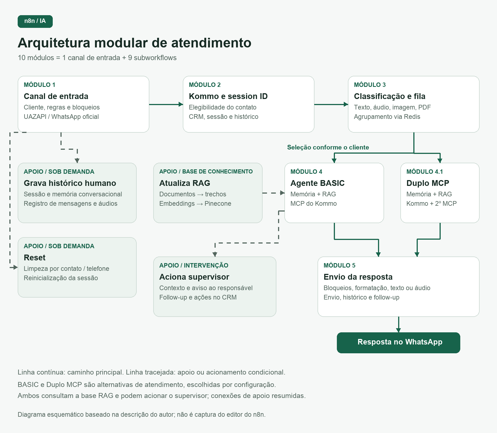
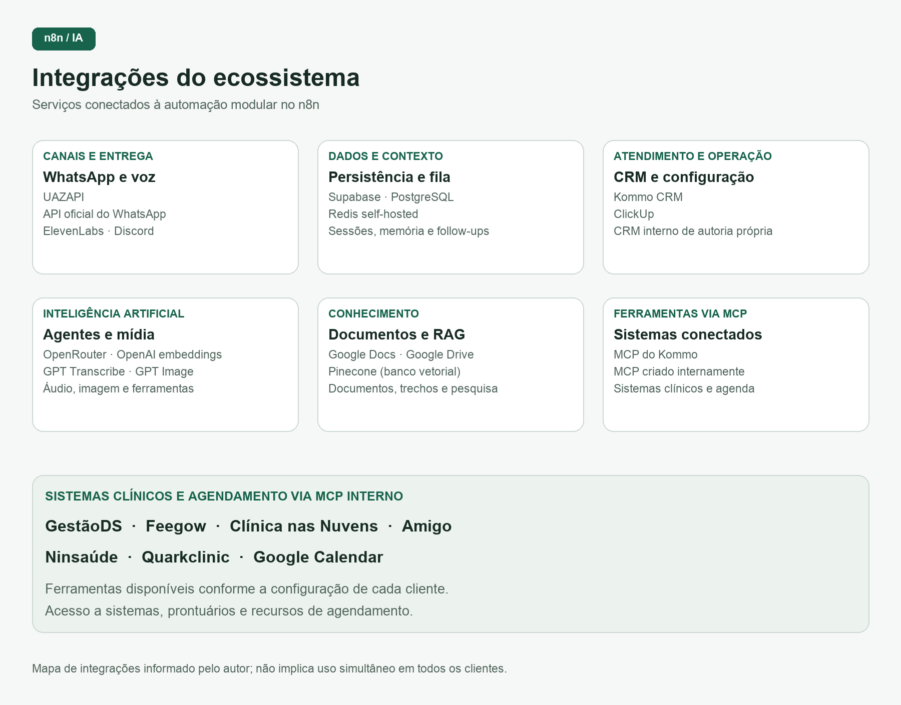

# Automação modular de atendimento com IA no n8n

## Visão geral

Automação de atendimento desenvolvida por **Thalyson Emanuel no n8n**, organizada em **10 módulos: 1 canal de entrada e 9 subworkflows**. A solução recebe mensagens, verifica a elegibilidade do contato, prepara conteúdos multimodais, executa agentes de IA e entrega respostas. Também mantém sessões e histórico, atualiza a base de conhecimento e encaminha conversas ao atendimento humano.

A arquitetura separa responsabilidades e permite configurar o comportamento do atendimento por cliente. O **Agente BASIC** e o **Agente Duplo MCP** são alternativas selecionadas pela configuração; não representam duas etapas sequenciais obrigatórias.

Este documento descreve a arquitetura funcional descrita pelo autor. Os diagramas são esquemáticos, elaborados a partir dessa descrição.

## Diagramas

### 1. Arquitetura e fluxo dos 10 módulos

### 2. Mapa de integrações

## Inventário dos módulos

| Nº | Módulo / workflow | Responsabilidade |
| --- | --- | --- |
| 1 | Canal de entrada | Recepção, configuração do cliente e roteamento inicial |
| 2 | Kommo e session ID | Elegibilidade no CRM e identificação da sessão |
| 3 | Classificação e fila de mensagens | Normalização de mídias e agrupamento de mensagens |
| 4 | Agente atendimento BASIC | Atendimento com memória, RAG e MCP do Kommo |
| 4.1 | Agente Duplo MCP | Atendimento com dois serviços de ferramentas via MCP |
| 5 | Envio resposta agente | Preparação e entrega da resposta no canal |
| Apoio | Aciona supervisor | Encaminhamento contextualizado ao responsável humano |
| Apoio | Atualiza RAG | Ingestão de documentos na base de conhecimento |
| Apoio | Reset | Reinicialização dos registros de um contato |
| Apoio | Grava histórico humano | Registro das conversas fora da resposta automática |

A numeração original foi preservada: **4.1 é um subworkflow próprio**. Assim, os módulos 2, 3, 4, 4.1, 5 e os quatro módulos de apoio totalizam os nove subworkflows.

## Integrações do ecossistema

| Área | Serviços e sistemas informados |
| --- | --- |
| Mensageria | UAZAPI e API oficial do WhatsApp |
| Persistência e contexto | Supabase, PostgreSQL e Redis self-hosted |
| CRM e operação | Kommo CRM, ClickUp e CRM interno de autoria própria |
| Agentes e mídia | OpenRouter, OpenAI, GPT Image, GPT Transcribe e ElevenLabs |
| Conhecimento e documentos | Pinecone, embeddings da OpenAI, Google Docs e Google Drive |
| Ferramentas | MCP do Kommo e MCP criado internamente |
| Sistemas clínicos e agendamento via MCP interno | GestãoDS, Feegow, Clínica nas Nuvens, Amigo, Ninsaúde, Quarkclinic e Google Calendar |
| Avisos e acompanhamento | WhatsApp e Discord |

As integrações são utilizadas conforme o módulo e a configuração de cada cliente. O inventário geral inclui **GPT Image e o CRM interno**, mas a descrição recebida não especifica seu vínculo com um módulo particular. A estrutura do canal de entrada está preparada para a API oficial do WhatsApp; outros módulos descrevem caminhos específicos para essa API.

## Documentação por módulo

### Módulo 1 — Canal de entrada

**Objetivo:** centralizar o recebimento das mensagens e controlar sua entrada no atendimento automatizado.

**Integrações:** WhatsApp via UAZAPI, ClickUp, Redis, Supabase, OpenAI e outros workflows do n8n. Estrutura também preparada para a API oficial do WhatsApp.

**Principais funções:**

- Identificar o cliente e carregar suas configurações de atendimento.
- Filtrar mensagens de grupos e envios automáticos.
- Aplicar regras de horário e verificar o status do agente.
- Controlar bloqueios por atendimento humano e atualizar follow-ups.
- Organizar os dados da mensagem e processar áudio e imagem nos caminhos destinados ao histórico.

**Comportamento:** recebe a mensagem e decide se ela deve seguir para atendimento automatizado, registro de histórico ou reinicialização da conversa.

### Módulo 2 — Kommo e session ID

**Objetivo:** verificar a elegibilidade do contato para atendimento e manter a identificação de sessão da conversa.

**Integrações:** Kommo CRM, Supabase, UAZAPI, OpenAI e outros workflows do n8n.

**Principais funções:**

- Consultar contatos e leads no CRM.
- Verificar etapas que restringem o atendimento e bloqueios da conversa.
- Recuperar ou criar a sessão.
- Transcrever áudios, analisar imagens e registrar mensagens.

**Comportamento:** relaciona a mensagem ao contato e à sessão correspondente. Conforme as condições do CRM e os bloqueios existentes, encaminha a conversa para classificação e fila ou mantém apenas seu registro no histórico.

### Módulo 3 — Classificação e fila de mensagens

**Objetivo:** transformar diferentes formatos de mensagem em conteúdo utilizável pelo agente e agrupar mensagens enviadas em sequência.

**Integrações:** Redis, OpenAI, UAZAPI, API oficial do WhatsApp e outros workflows do n8n.

**Principais funções:**

- Identificar texto, áudio, imagem e documento.
- Baixar mídias, transcrever áudios, interpretar imagens e extrair texto de PDFs.
- Organizar a fila de mensagens e aguardar o intervalo configurado.
- Selecionar o modelo de atendimento conforme a configuração do cliente.

**Comportamento:** converte o conteúdo recebido em texto e reúne mensagens consecutivas. Após consolidar o conteúdo, encaminha a solicitação ao Agente BASIC ou ao Agente Duplo MCP.

### Módulo 4 — Agente atendimento BASIC

**Objetivo:** executar o atendimento por IA com contexto da conversa, instruções do cliente e acesso a ferramentas.

**Integrações:** OpenRouter, Google Docs, Google Drive, Supabase, PostgreSQL, Pinecone, OpenAI para embeddings e Kommo via MCP.

**Principais funções:**

- Carregar as instruções do agente e consultar uma cópia de segurança do prompt.
- Recuperar a memória da conversa e pesquisar a base de conhecimento.
- Utilizar ferramentas do CRM e realizar cálculos.
- Solicitar intervenção do supervisor.
- Atualizar o backup das instruções e inserir documentos na base de conhecimento nas rotinas previstas.

**Comportamento:** interpreta a solicitação e produz uma resposta usando histórico, instruções e informações disponíveis. Encaminha a resposta ao módulo de envio.

### Módulo 4.1 — Agente Duplo MCP

**Objetivo:** executar o atendimento por IA com acesso a dois serviços de ferramentas via MCP.

**Integrações:** OpenRouter, Google Docs, Supabase, PostgreSQL, Pinecone, OpenAI para embeddings, Kommo via MCP e um segundo serviço MCP configurável.

**Principais funções:**

- Carregar instruções e recuperar o histórico.
- Consultar a base de conhecimento.
- Acessar ferramentas dos dois MCPs e realizar cálculos.
- Acionar o supervisor e controlar tentativas de processamento.

**Comportamento:** combina o contexto da conversa com ferramentas do CRM e do segundo sistema conectado. O MCP interno permite integrar recursos de sistemas e prontuários clínicos e de agendamento, conforme a configuração do cliente. A resposta segue para o módulo de envio.

### Módulo 5 — Envio resposta agente

**Objetivo:** preparar e entregar ao usuário a resposta produzida pelo agente.

**Integrações:** UAZAPI, API oficial do WhatsApp, Redis, Supabase, PostgreSQL, OpenRouter, ElevenLabs e Discord.

**Principais funções:**

- Verificar bloqueios de atendimento humano.
- Formatar respostas e dividir textos longos.
- Gerar áudio e enviar mensagens pelo canal utilizado.
- Conferir a chegada de novas mensagens.
- Atualizar históricos e follow-ups.

**Comportamento:** adapta a resposta ao formato e ao canal, podendo entregar texto em partes ou áudio. Antes de determinados envios, verifica se chegou uma nova mensagem do usuário, evitando continuar uma resposta que perdeu o contexto.

### Módulo de apoio — Aciona supervisor

**Objetivo:** encaminhar ao responsável humano informações sobre uma conversa que exige acompanhamento ou intervenção.

**Integrações:** PostgreSQL, Supabase, OpenRouter, UAZAPI, API oficial do WhatsApp, Kommo CRM e Discord.

**Principais funções:**

- Receber solicitações de supervisão e consultar o histórico.
- Gerar uma notificação contextualizada e enviar avisos aos responsáveis.
- Atualizar o controle de follow-up.
- Movimentar leads nas situações configuradas.

**Comportamento:** reúne o contexto e envia uma comunicação ao supervisor pelo canal definido. Nos cenários previstos, atualiza a etapa do contato no CRM para refletir o encaminhamento ou o agendamento.

### Módulo de apoio — Atualiza RAG

**Objetivo:** alimentar a base de conhecimento consultada pelos agentes.

**Integrações:** Google Drive, OpenAI para embeddings e Pinecone, com caminho de configuração por cliente utilizando o ClickUp.

**Principais funções:**

- Baixar documentos e carregar seu conteúdo.
- Dividir textos em trechos.
- Gerar representações vetoriais com embeddings.
- Inserir as informações na base de conhecimento.

**Comportamento:** processa documentos de referência e os disponibiliza para pesquisa semântica. Os agentes passam a consultar informações específicas do cliente ao elaborar respostas.

### Módulo de apoio — Reset

**Objetivo:** reinicializar os registros de atendimento de um contato específico.

**Integrações:** PostgreSQL, Redis e UAZAPI.

**Principais funções:**

- Excluir a memória da conversa e remover registros de chat e mensagens.
- Apagar a associação de sessão do contato.
- Atualizar um controle temporário no Redis.
- Enviar uma confirmação.

**Comportamento:** limpa os registros vinculados ao telefone informado, permitindo o início de uma nova sessão. A exclusão é direcionada ao contato recebido pelo módulo.

### Módulo de apoio — Grava histórico humano

**Objetivo:** preservar o contexto das mensagens durante atendimento humano ou fora do fluxo de resposta automática.

**Integrações:** Supabase, PostgreSQL, UAZAPI e OpenAI.

**Principais funções:**

- Consultar ou criar a sessão do contato.
- Preparar as mensagens no formato da memória conversacional.
- Transcrever áudios nos caminhos implementados.
- Gravar o histórico e atualizar registros da conversa.

**Comportamento:** registra as mensagens recebidas pelos caminhos destinados ao histórico, mantendo a continuidade para consultas e atendimentos posteriores. Quando recebe áudio nos caminhos implementados, transforma seu conteúdo em texto antes da gravação.

## Comportamentos transversais

- **Configuração por cliente:** instruções, horários, canal, agente e ferramentas disponíveis.
- **Continuidade do contexto:** sessões, memória conversacional e registro de mensagens de IA e atendimento humano.
- **Controle de atendimento:** elegibilidade no CRM, bloqueios por intervenção humana e status do agente.
- **Tratamento multimodal:** texto, áudio, imagem e documentos convertidos para os caminhos de processamento previstos.
- **Fila e atualização de contexto:** agrupamento de mensagens consecutivas e verificação de novas mensagens antes de determinados envios.
- **Conhecimento e ferramentas:** RAG, ferramentas via MCP e integração com sistemas externos.
- **Acompanhamento:** follow-ups, supervisão e ações configuradas no CRM.
